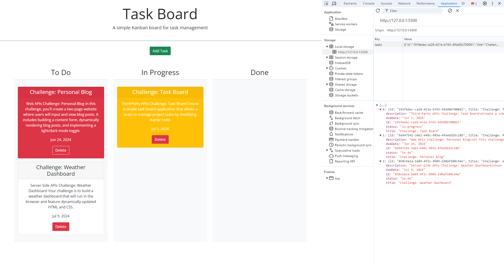
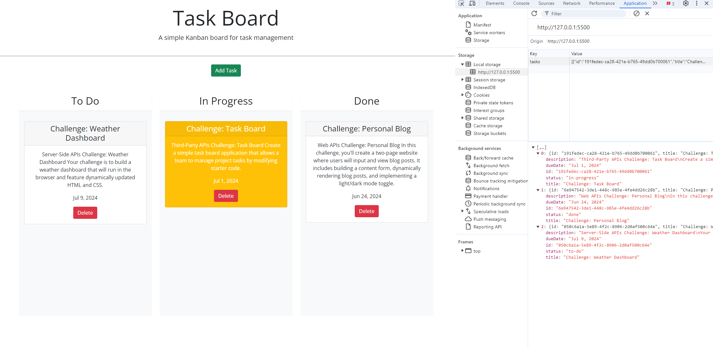
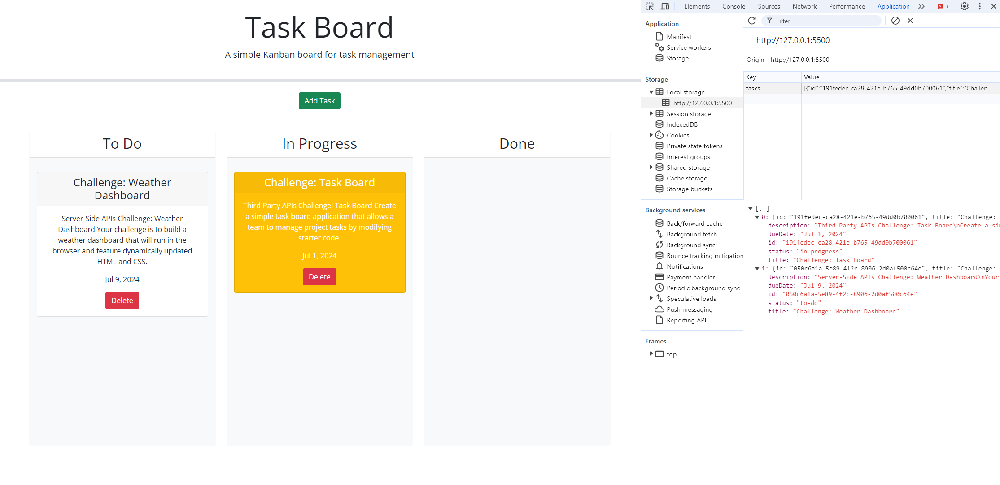
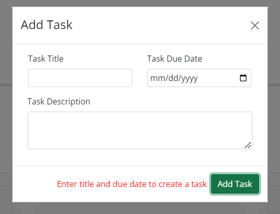
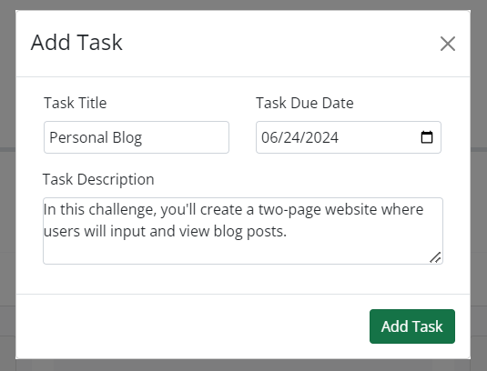
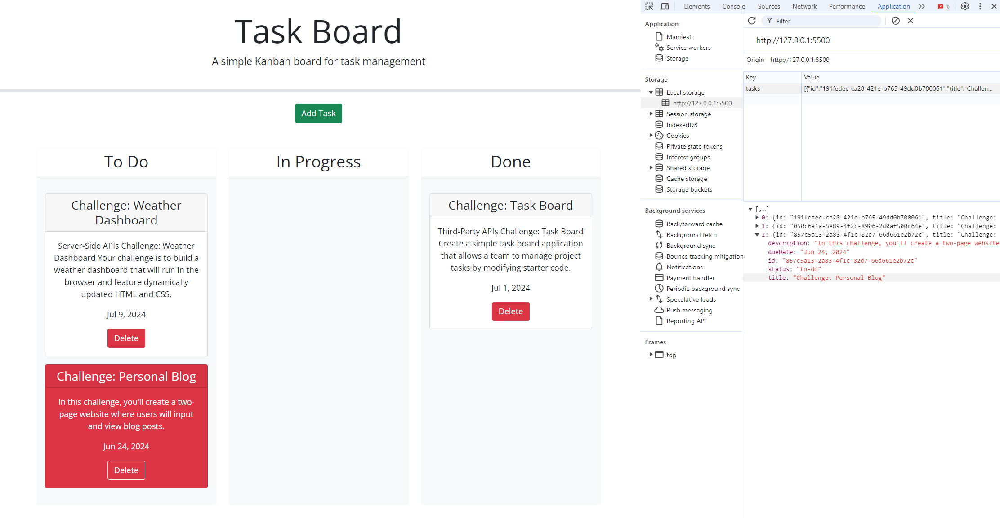

# Task Board

## Task

In this Challenge I modifyed starter code for a task board application that allows a team to manage project tasks. This application runs in the browser and features dynamically updated HTML and CSS powered by jQuery.

## Screenshots

The landing page containing a list of project tasks that are displayed in columns representing the task progress state (To Do, In Progress, Done). 
- Each task is color coded to indicate whether it is nearing the deadline (yellow) or is overdue (red).

  

- Dragging a task to a different progress column updates the task's progress state accordingly; the task stays in the new column after refreshing a page:

  

- Clicking the delete button for a task, removes the task from the board; the task is not added back after refreshing a page. After refreshing the page, the saved tasks persist.

  

The modal to define a new task containing a title, description and deadline date for the new task. 
- Error message is displayed when saving an empty task.
- Upon saving a task, the properties for that task are saved in localStorage.

  
    
  

## Review

The URL of the deployed application: 